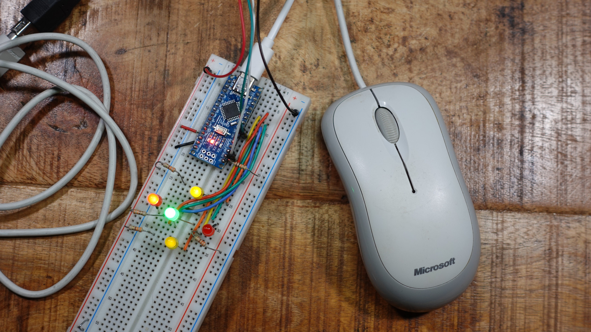

# Arduinomouse
Easy to use Arduino library for connecting PS/2 or PS/2 compatible USB mice to AVR based Arduino boards.

## Connecting the Mouse
Connect the mouse to the Arduino as shown in the pictures below. With the 10k resistor between Vcc and Data, it is possible to upload the sketch with the mouse connected.

 Connection of mouse with PS/2 connector

 Connection of mouse with USB connector

## Usage
Copy [ps2mouse.cpp](sketch/ps2mouse.cpp) and [ps2mouse.h](sketch/ps2mouse.h) to your project directory. Include [ps2mouse.h](sketch/ps2mouse.h).
The script must call ```mouse_init() ``` in its setup() function and ```mouse_update()``` in the loop() function. The ```on_mouse()``` callback is called when the mouse has moved or a button was pressed.
There are also two optional callback functions ```on_mouse_ready()``` and ```on_mouse_disconnected()``` that are called when the mouse is plugged in and ready to use or plugged out.
## Example Sketch
Try the [Example](sketch/sketch.ino) circuit and Arduino sketch.

 Example on breadboard

 Circuit diagram of Example